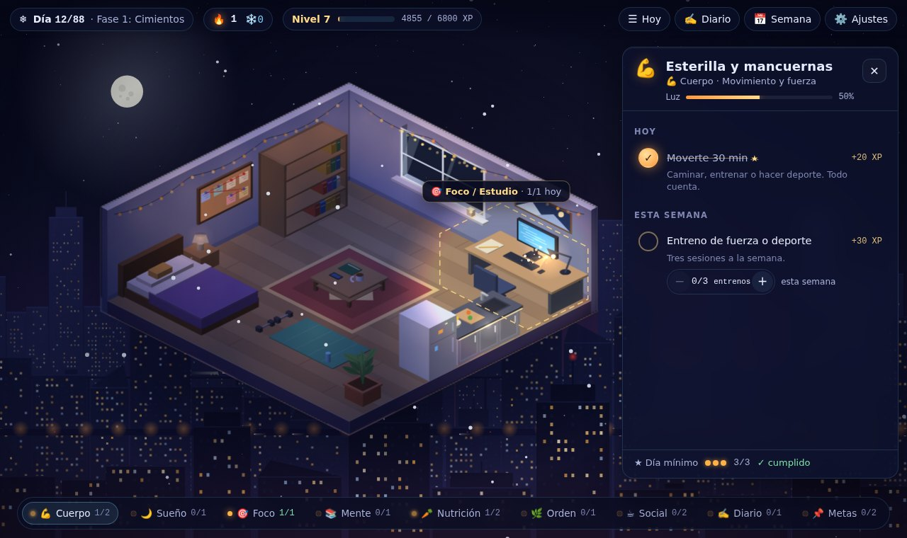
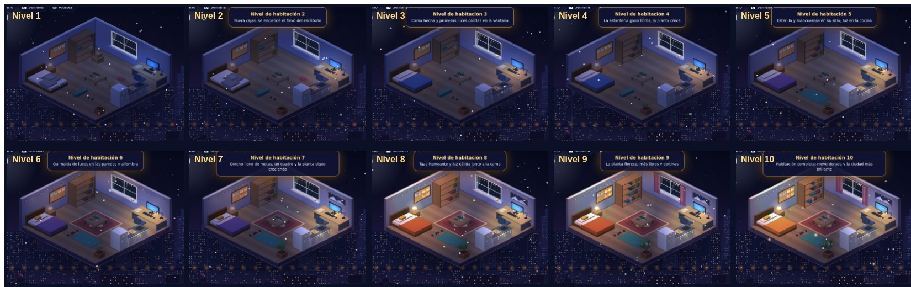

# ❄ Winter Arc Room

> *Tu habitación es tu progreso: cada tarea real que cumples enciende una luz.*

Juego web de escena isométrica: un apartamento nocturno flotando sobre una ciudad iluminada, con nieve cayendo. No hay combate ni avatar: cumples tareas reales de tu *winter arc* (del inicio del arco al 31 de diciembre) y la habitación **evoluciona visualmente** de un cuarto oscuro y desordenado a un espacio cálido, ordenado y vivo.



Prototipo jugable en el navegador, de una sola página y sin backend. Todo el arte es código (Canvas 2D), sin assets binarios, sin red y sin telemetría.

---

## Cómo ejecutarlo

Requisitos: Node 18+ (probado con Node 22).

```bash
npm install
npm run dev        # http://localhost:5173
```

| Comando | Qué hace |
|---|---|
| `npm run dev` | Servidor de desarrollo (Vite) |
| `npm run build` | Comprobación de tipos + build de producción en `dist/` |
| `npm run preview` | Sirve el build de producción |
| `npm test` | Tests unitarios de la lógica de juego (Vitest) |
| `npm run simulate` | Simula un arco completo de 88 días e imprime rachas, tokens, XP y nivel por semana |
| `npm run typecheck` | Solo TypeScript |

El build es estático: `dist/` se puede servir desde cualquier hosting de ficheros.

## Cómo se juega

1. **Pantalla de inicio** (primer uso), en 3 pasos: fecha de inicio del arco, intensidad (Suave / Normal / Intensa) con tu hora objetivo para acostarte, y de 1 a 3 metas del arco.
2. **La escena es la interfaz.** Cada pilar de vida está ligado a un objeto. Pasa el ratón por encima (contorno brillante + tooltip con el progreso de hoy) y haz clic para abrir sus tareas.
3. **Completa tareas**: chispas doradas desde el objeto, XP flotante y el objeto se ilumina un poco más. Al subir de nivel, un barrido de luz recorre la habitación.

| Objeto | Pilar |
|---|---|
| 💪 Esterilla y mancuernas | Cuerpo |
| 🌙 Cama | Sueño |
| 🎯 Escritorio (con Pomodoro 25/5) | Foco / Estudio |
| 📚 Estantería | Mente / Lectura |
| 🥕 Cocina | Nutrición |
| 🌿 Planta | Orden (hogar) |
| ☕ Mesa baja | Social / Finanzas |
| ✍️ Ventana | Reflexión · diario nocturno |
| 📌 Corcho | Metas del arco y reto semanal |

### Controles

- **Ratón / táctil**: clic en un objeto para abrir su panel; clic en el vacío para cerrarlo.
- **Dock inferior**: los mismos objetos como botones (accesible por teclado y cómodo en móvil).
- **HUD**: `Hoy` (lista plana de todas las tareas del día), `Diario`, `Semana` (resumen semanal) y `Ajustes`.
- **Teclado**: `Tab` para moverte, `Enter`/`Espacio` para activar, `Esc` cierra paneles y modales.
- En móvil el panel aparece como hoja inferior; la vista **Hoy** es la forma más rápida de jugar.

### Reglas

- **Día lógico**: el día cambia a las **04:00** locales (si trasnochas, sigue siendo "hoy"). Las semanales se reinician el lunes a las 04:00.
- **El arco**: por defecto 88 días, del 5 oct al 31 dic 2026, en tres fases: **Cimientos** (28 d), **Construcción** (35 d, aparecen tareas nuevas y retos semanales) y **Remate** (25 d). Si empiezas en otra fecha, el arco termina igualmente el 31/12 y las fases se reparten en la misma proporción. Antes de la fecha de inicio estás en *calentamiento*: las tareas ya cuentan.
- **Día mínimo viable**: completar **3 tareas ★** hace que el día cuente para la racha aunque no hagas el resto. Hacer todas las diarias da **+20 % de XP**.
- **Racha** 🔥: días seguidos con el mínimo cumplido.
- **Tokens de descanso** ❄️: ganas 1 por semana cerrada con ≥5 días válidos (máximo 2). Un token salva automáticamente un día fallado si la racha estaba viva, o puedes gastarlo para planear un descanso desde la vista *Hoy*.
- **Día malo** 🌧: una vez por semana, ese día bastan 2 tareas ★ (sin bonus).
- **La habitación nunca retrocede**: perder la racha la pone a 0, pero no resta XP ni nivel. Si fallas 3 días seguidos, al volver verás un mensaje de reentrada en lugar de una pantalla de fracaso. El HUD nunca muestra días perdidos.
- **Nivel de habitación** (1–10) por XP acumulado. Cada nivel desbloquea cambios visibles (ver abajo). Además, cada pilar tiene un **medidor de luz** que modula el brillo de su objeto: descuidar un pilar se nota sin penalizar.
- **Resumen semanal**: se abre solo el domingo (o con el botón *Semana*): días válidos, XP, lo más y lo menos cumplido y **una sola** pregunta de ajuste (bajar o subir la dificultad de una tarea).
- **Reto "jefe"** (fases 2 y 3): cada lunes, un reto rotativo de una lista de 12. Cumplirlo da +60 XP y deja un recuerdo temporal sobre la estantería.

### Los 10 niveles



| Nivel | Cambio visual |
|---|---|
| 1 | Oscura y desordenada (ropa y cajas), una sola luz tenue |
| 2 | Fuera cajas; se enciende el flexo |
| 3 | Cama hecha; luces cálidas en la ventana |
| 4 | Más libros; la planta crece |
| 5 | Esterilla y mancuernas en su sitio; luz en la cocina |
| 6 | Guirnalda de luces y alfombra |
| 7 | Corcho lleno, un cuadro, planta más grande |
| 8 | Taza humeante y lámpara de la cama encendida |
| 9 | La planta florece, más libros, cortinas |
| 10 | Nieve dorada y la ciudad más brillante |

## Tus datos

- Se guardan **solo en tu navegador** (`localStorage`, clave `winterArcRoom.v1`), con guardado automático 300 ms después de cada cambio.
- **Ajustes → Exportar JSON** descarga una copia; **Importar JSON** la restaura (se valida la versión y la estructura).
- Si `localStorage` no está disponible (p. ej. modo privado), el juego funciona en memoria y muestra un aviso.
- **Ajustes → Reiniciar arco** borra todo tras una doble confirmación.

## Editar las tareas (`src/content/quests.json`)

La plantilla de tareas vive en [`src/content/quests.json`](src/content/quests.json). Cada tarea:

```jsonc
{
  "id": "nutri-agua",            // único y estable (se usa en el registro diario)
  "pillar": "nutricion",         // cuerpo | sueno | foco | mente | nutricion | orden
  "title": "Beber ~2 L de agua", // {hora} se sustituye por la hora objetivo de dormir
  "description": "…",            // opcional
  "kind": "daily",               // daily | weekly | milestone
  "mode": "counter",             // boolean | counter | timer | text
  "target": 8,                   // counter: objetivo; timer: minutos
  "unit": "vasos",               // opcional, para contadores
  "xp": 15,
  "minimumViable": true,         // ★: cuenta para el día mínimo viable
  "phaseFrom": 2,                // opcional: aparece desde esa fase
  "tier": "core",                // core = Suave · normal = Normal · plus = solo Intensa
  "object": "table",             // opcional: objeto de la escena (si no, el del pilar)
  "tags": ["pomodoro"]           // opcional: pomodoro | journal | boss
}
```

- `bossChallenges` es la lista de 12 retos semanales.
- La partida guarda una **copia editable** de la plantilla. Cambiar el JSON afecta a partidas nuevas; las tareas con un `id` nuevo se añaden también a partidas existentes al cargarlas. Para cambiar tareas ya existentes en tu partida: *Ajustes → Tareas* (activar/desactivar), el resumen semanal (ajustes de dificultad), o exportar, editar el JSON exportado e importarlo.
- El contenido es una plantilla genérica de hábitos sostenibles: sin contenido médico, ayunos ni dietas restrictivas.

`src/content/pillars.json` define nombres, iconos y colores de los pilares y qué objeto corresponde a cada uno.

## Consola de depuración

Abre las herramientas del navegador y usa `window.__debug`:

```js
__debug.addXp(500)    // suma XP (prueba niveles)
__debug.setLevel(7)   // fija el nivel de habitación
__debug.setDay(29)    // viaja al día 29 del arco (inicio de la fase 2) sin esperar días reales
__debug.resetDay()    // vuelve a la fecha real
__debug.today()       // día lógico actual
__debug.state()       // estado completo
__debug.help()
```

`setDay` mueve un reloj virtual (no se guarda): al recargar vuelves a la fecha real.

## Estructura

```
winter-arch-shelter/
├─ index.html
├─ package.json · tsconfig.json · vite.config.ts
├─ docs/                    # capturas para este README (el juego no usa imágenes)
└─ src/
   ├─ main.ts               # arranque: almacenamiento + controlador
   ├─ app.ts                # controlador: estado ↔ escena ↔ interfaz, bucle, eventos, depuración
   ├─ engine/
   │  ├─ iso.ts             # proyección 2:1, drawBox/drawCylinder, depth sort, envolventes, picking
   │  ├─ renderer.ts        # compone capas; cachea el cuarto iluminado; vista y desplazamiento
   │  ├─ input.ts           # ratón/touch, hover y tap
   │  ├─ particles.ts       # nieve en dos planos, chispas, XP flotante, vapor, motas
   │  ├─ audio.ts           # sonidos sintetizados con Web Audio
   │  ├─ color.ts           # utilidades de color
   │  └─ random.ts          # PRNG con semilla
   ├─ scene/
   │  ├─ room.ts            # suelo, losa del diorama, paredes con hueco de ventana
   │  ├─ objects.ts         # catálogo de objetos y su arte procedural por nivel
   │  ├─ city.ts            # skyline en 3 capas, ventanas, balizas, coches, tren
   │  ├─ lighting.ts        # mapa de luz (multiply), focos, halos, cono del flexo, viñeta
   │  └─ palette.ts         # materiales y ambiente por nivel/fase
   ├─ game/                 # lógica pura (sin DOM ni canvas), con tests
   │  ├─ state.ts           # tipos, contenido y creación de partida
   │  ├─ quests.ts          # progreso, XP, mínimo viable, bonus, temporizadores, diario, metas, reto
   │  ├─ streaks.ts         # rachas, tokens, día malo, reentrada, resumen semanal
   │  ├─ progression.ts     # niveles y medidores de luz
   │  ├─ calendar.ts        # día lógico, fases, día N de M
   │  ├─ storage.ts         # localStorage + export/import JSON
   │  └─ *.test.ts          # Vitest (incluye simulate.test.ts)
   ├─ ui/
   │  ├─ hud.ts             # barra superior, dock, tooltip, toasts, tarjeta de fase
   │  ├─ panel.ts           # panel lateral por objeto y vista "Hoy"
   │  ├─ modals.ts          # inicio, diario, resumen semanal, ajustes, mensajes
   │  ├─ dom.ts             # helpers (escape, descarga, foco)
   │  └─ styles.css
   └─ content/
      ├─ pillars.json
      └─ quests.json
```

**Separación**: `game/` es lógica pura y testeable; `scene/` y `engine/` solo leen el estado y dibujan; `ui/` modifica el estado a través de funciones de `game/` (vía `App.act`).

## Decisiones y desviaciones respecto al documento de diseño

Lo ambiguo se resolvió con la opción más simple; aquí queda anotado:

1. **Paredes**: con la proyección del documento, la línea `y = 0` queda arriba a la derecha, así que la pared izquierda es `x = 0` y la derecha `y = 0` (la ventana sigue en la pared derecha). Las coordenadas de algunos objetos se ajustaron para que nada se tape.
2. **Cocina**: está en el borde abierto del diorama, con las puertas de los armarios hacia el espectador; la nevera mide 1,75 (más alta que el 1,1 de la tabla) para que se lea como nevera.
3. **Fases en arcos más cortos**: se reparten en proporción 28/35/25.
4. **~8 diarias en Normal**: *Sin pantallas los últimos 30 min* y *Planificar mañana* se desbloquean en la fase 2 para respetar el límite de ~8 diarias en la fase 1.
5. **Día mínimo viable** = 3 de las tareas ★ activas (2 en día malo), no todas. El diario cuenta como ★ en Normal/Intensa y está activo también en Suave (sin ★).
6. **Leer 15 min** y **Meditar 5 min** son temporizadores que también se pueden marcar a mano. Cada Pomodoro terminado suma también al contador *3 bloques Pomodoro* (Intensa) y arranca un descanso de 5 min.
7. **Tokens**: se gastan solos solo si la racha venía viva (no se desperdician); se ganan al cerrar la semana (domingo).
8. **Deshacer** una tarea retira su XP (evita sumar XP marcando y desmarcando). Es la única forma de que el nivel baje.
9. **Temporizadores** basados en marcas de tiempo: sobreviven a recargas y se completan aunque la pestaña haya estado en segundo plano.
10. **Curva de niveles**: umbrales `0, 150, 500, 1100, 2000, 3200, 4800, 6800, 9300, 12500` XP en Normal, ×0,65 en Suave y ×1,2 en Intensa. La simulación (75 % de adherencia) acaba en nivel 9 en Normal y Suave.
11. **Medidor de luz** = máx(cumplimiento de hoy, media de los últimos 7 días) de las tareas del objeto. El corcho también se ilumina con las metas cumplidas.
12. **Reto semanal**: es una tarea semanal con la etiqueta `boss` en el corcho; su título rota cada lunes. La decoración se ve la semana en que se cumple y la siguiente.
13. **Campos extra** (opcionales) en los tipos del documento: `Quest.tier/object/unit/tags`, `DayLog.xp/bonus/restDay/tokenUsed`, `arc.bedtime` y `GameState.meta` (último día procesado, último nivel/fase vistos, temporizador…).
14. **Archivos extra** respecto al árbol del documento: `src/app.ts`, `engine/audio.ts`, `engine/color.ts`, `engine/random.ts`, `ui/dom.ts`, `game/testutil.ts`. `storage.importJSON` recibe el texto del archivo (lo lee la interfaz) para que `game/` siga siendo puro.
15. **Rendimiento**: el cuarto iluminado se cachea en un lienzo aparte y solo se repinta cuando cambia algo o para las animaciones (a 20 Hz si el equipo va justo); la ciudad y la viñeta se pre-renderizan y el mapa de luz va a media resolución.
16. **Sonido**: activado por defecto en Ajustes, pero no suena nada hasta el primer clic o tecla (política de autoplay).

## Criterios de aceptación

- [x] `npm install && npm run dev` arranca sin errores ni avisos.
- [x] Escena isométrica nocturna con ciudad de fondo, nieve y luces cálidas.
- [x] 6 pilares ligados a objetos clicables; panel con tareas del día.
- [x] Completar tareas da XP, ilumina la escena y sube el nivel de habitación.
- [x] Racha, día mínimo viable y tokens de descanso según §5.4.
- [x] Datos persistentes tras recargar; export/import JSON operativo.
- [x] Fase del arco y "Día N/88" según la fecha real.
- [~] Navegadores: probado en Chromium (escritorio y móvil emulado). Solo usa APIs estándar (Canvas 2D, Web Audio, `localStorage`); falta probarlo a mano en Firefox y Safari.
- [x] Sin assets externos, sin red, sin telemetría.
- [x] Lógica de `game/` con tests unitarios (`npm test`, 38 tests).
